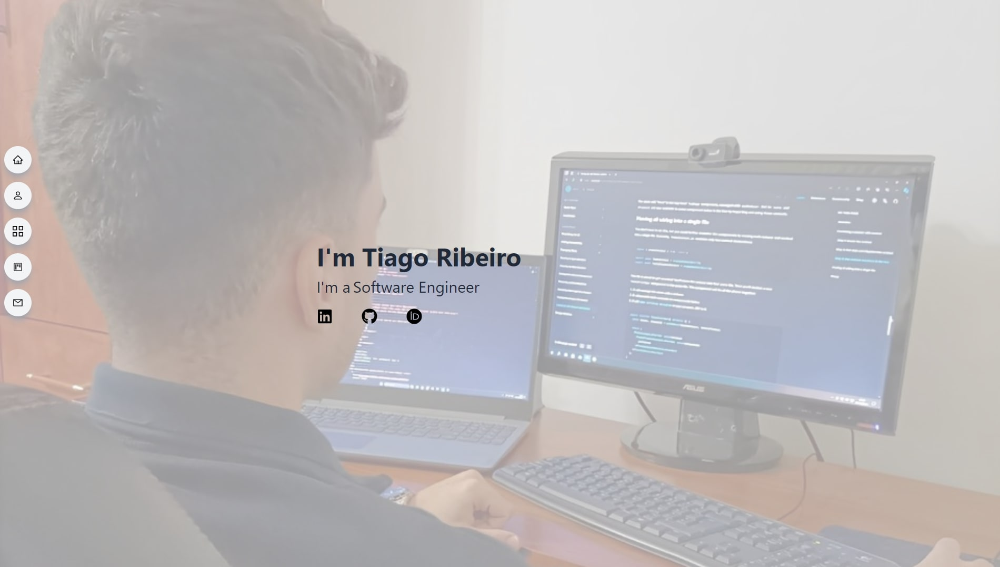

<!-- Improved compatibility of back to top link: See: https://github.com/othneildrew/Best-README-Template/pull/73 -->

<!--
*** Thanks for checking out the Best-README-Template. If you have a suggestion
*** that would make this better, please fork the repo and create a pull request
*** or simply open an issue with the tag "enhancement".
*** Don't forget to give the project a star!
*** Thanks again! Now go create something AMAZING! :D
-->

<!-- PROJECT LOGO -->

  <h3 align="center">Portfolio</h3>

  

    A dynamic portfolio to showcase my projects and skills
  

<!-- TABLE OF CONTENTS -->

  
Table of Contents

  <ol>
    <li>
      <a href="#about-the-project">About The Project</a>
      <ul>
        <li><a href="#built-with">Built With</a></li>
      </ul>
    </li>
    <li><a href="#usage">Usage</a></li>
    <li><a href="#contact">Contact</a></li>
  </ol>

<!-- ABOUT THE PROJECT -->
## About The Project

 

  

 

As a software engineer, I have had the opportunity to work on a wide variety of projects that showcase my skills, creativity, and technical expertise. This portfolio is a reflection of my journey, demonstrating not only my professional experience but also the passion I have for solving complex problems through technology.

Here’s what you’ll find:
* My experience across different technologies, from front-end to back-end development, and everything in between.
* A showcase of my commitment to continuous learning and applying best practices.

While this portfolio highlights many of my achievements, I am always eager to improve and expand it with new projects and ideas.

Take a look around and discover how my expertise can help bring value to your next project.

(<a href="#readme-top">back to top</a>)

### Built With

This portfolio was built using the following technologies:

* [![React][React.js]][React-url]
* [![Vite][Vite]][Vite-url]
* [![Tailwind CSS][Tailwind CSS]][Tailwind CSS-url]
* [![GitHub Pages][GitHub Pages]][GitHub Pages-url]

(<a href="#readme-top">back to top</a>)

<!-- USAGE EXAMPLES -->
## Usage

You can explore my portfolio and see examples of my work by visiting the following link: [https://tiagoribeiro2001.github.io/portfolio/](https://tiagoribeiro2001.github.io/portfolio/)

In my portfolio, you'll find detailed descriptions of projects I've worked on. Feel free to browse through the different sections to learn more about my skills and experience.

(<a href="#readme-top">back to top</a>)

<!-- CONTACT -->
## Contact

Tiago Ribeiro - ribeiro.tiago2001@gmail.com

Project Link: [https://github.com/tiagoribeiro2001/portfolio](https://github.com/tiagoribeiro2001/portfolio)

(<a href="#readme-top">back to top</a>)

<!-- MARKDOWN LINKS & IMAGES -->
<!-- https://www.markdownguide.org/basic-syntax/#reference-style-links -->

[React.js]: https://img.shields.io/badge/React-20232A?style=for-the-badge&logo=react&logoColor=61DAFB
[React-url]: https://reactjs.org/
[Vite]: https://img.shields.io/badge/vite-%23646CFF.svg?style=for-the-badge&logo=vite&logoColor=white
[Vite-url]: https://vite.dev/
[Tailwind CSS]: https://img.shields.io/badge/tailwindcss-%2338B2AC.svg?style=for-the-badge&logo=tailwind-css&logoColor=white
[Tailwind CSS-url]: https://tailwindcss.com/
[GitHub Pages]: https://img.shields.io/badge/github%20pages-121013?style=for-the-badge&logo=github&logoColor=white
[GitHub Pages-url]: https://pages.github.com/
